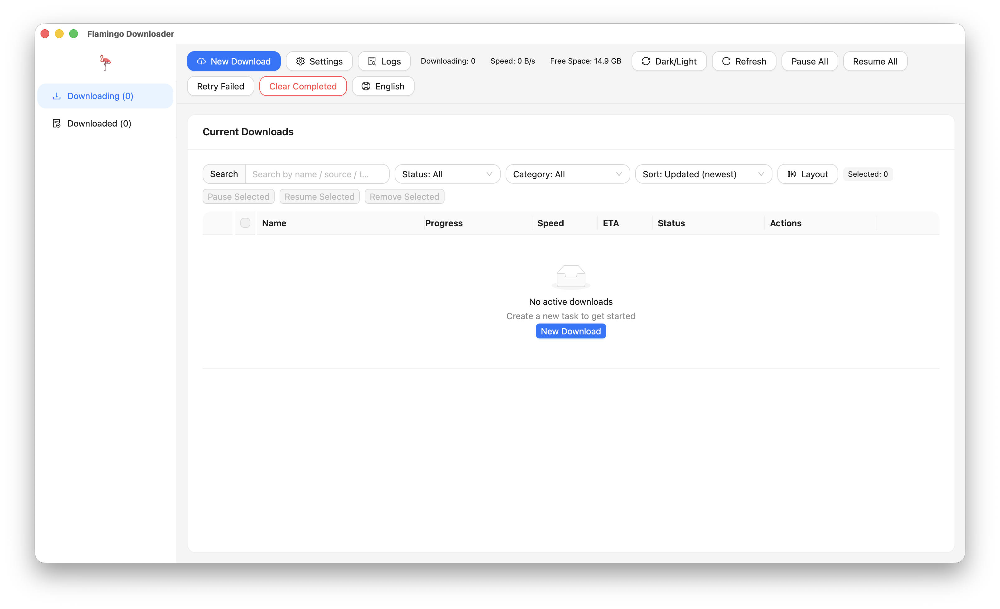
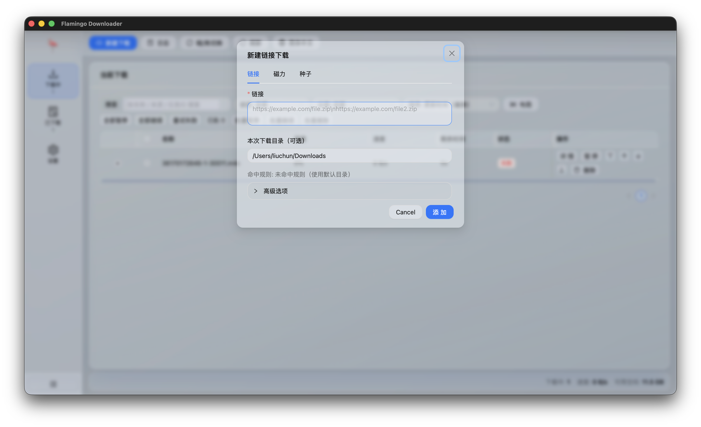
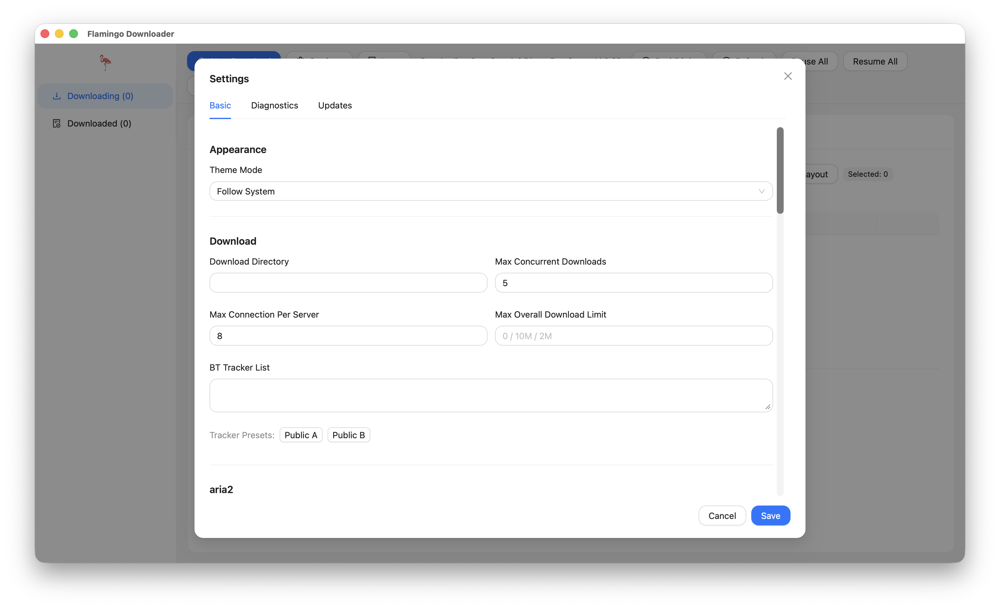

# 🦩 Flamingo Downloader

[](https://github.com/lc5900/flamingo-downloader/actions/workflows/build-release.yml)
[](LICENSE)
[](https://tauri.app)
[](https://www.rust-lang.org)

A cross-platform desktop downloader built with **Tauri + Rust + aria2**.

Flamingo focuses on delivering a stable **download product** (task UX, persistence, diagnostics, rules), while aria2 handles protocol-level downloading.

中文说明请看：[`README_zh.md`](README_zh.md)

## Table of Contents

- [Highlights](#highlights)
- [Screenshots](#screenshots)
- [Architecture](#architecture)
- [Quick Start](#quick-start)
- [Build and Release](#build-and-release)
- [Browser Integration](#browser-integration)
- [Project Layout](#project-layout)
- [License](#license)

## Highlights

- HTTP/HTTPS/FTP, magnet, torrent via aria2 JSON-RPC
- Downloading / Downloaded views with modern task actions
- Per-task options + runtime updates (speed, split, seeding)
- Multi-rule download directories by `ext/domain/type`
- Category rules and grouped filtering
- Full settings page + diagnostics + operation logs window
- i18n (`en-US`, `zh-CN`), theme mode (`system/light/dark`)
- Browser bridge + extension template (Chromium + Firefox)
- Native messaging host installer scripts for Win/macOS/Linux
- SQLite persistence + session recovery + startup self-check

## Screenshots

> Real screenshots are stored in `docs/screenshots/`.

### Main Window



### New Download Dialog



### Settings and Diagnostics



## Architecture

- **UI layer (Tauri WebView)**: task list, settings, dialogs, logs
- **Rust service layer**: aria2 lifecycle, RPC wrapper, validation, state sync, DB
- **aria2 process**: protocol executor and transfer engine

Core principles:

- UI never talks to aria2 RPC directly
- aria2 RPC only listens on localhost with token
- App-level task model is the source of truth

## Quick Start

### 1) Prerequisites

- Rust (stable)
- Tauri 2 build dependencies for your OS
- `aria2c` binary (manual path mode currently enabled)
- Node.js 20+ for UI build

### 2) Run in development

```bash
cargo run --manifest-path src-tauri/Cargo.toml
```

### 3) UI workspace (React + Ant Design)

```bash
cd ui
npm install
npm run dev
```

### 4) First-time setup

In **Settings**:

1. Configure `aria2 Binary Path`
2. (Optional) click `Detect aria2 Path`
3. Save
4. Click `Restart aria2`
5. Click `RPC Ping`

## Build and Release

### Local bundle build

```bash
# Build UI assets first (frontendDist = ../ui/dist)
npm --prefix ui run build

# Build tauri bundles
cd src-tauri
cargo tauri build
```

### GitHub Actions

Workflow file: `.github/workflows/build-release.yml`

- Validates Rust + UI (fmt/clippy/lint/build)
- Builds Linux / Windows / macOS (Apple Silicon)
- Stages aria2 binaries before bundling
- Uploads desktop bundles + browser extension zip assets
- Auto-publishes Release on tags like `v0.1.0`
- Supports macOS signing/notarization if Apple secrets are provided

## Browser Integration

- HTTP bridge endpoint: `127.0.0.1 + token`
- Extension source: [`browser-extension/`](browser-extension)
- Extension docs: [`browser-extension/README.md`](browser-extension/README.md)
- Native messaging host scripts: [`browser-extension/native-host/`](browser-extension/native-host)
- DRM note: encrypted DRM streams (Widevine/FairPlay/PlayReady) are not downloadable.

## Project Layout

```text
src/                # Rust core service
src-tauri/          # Tauri entry and packaging config
ui/                 # React + Ant Design frontend
aria2/              # bundled/runtime aria2 binaries
browser-extension/  # browser extension templates
```

## License

MIT License, see [`LICENSE`](LICENSE).

Third-party note: aria2 is distributed under its own license terms.
