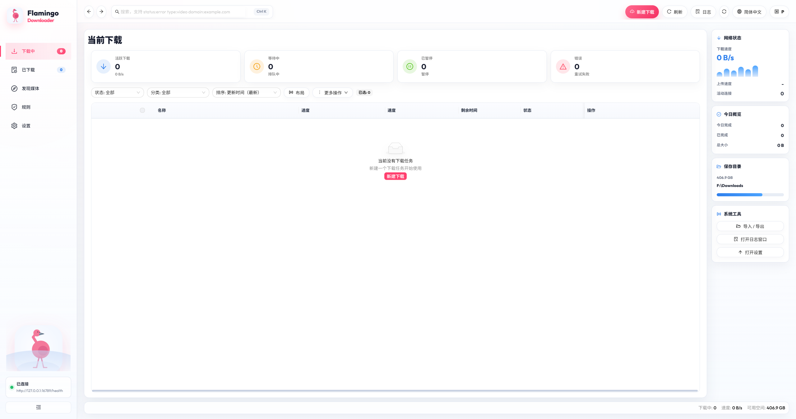
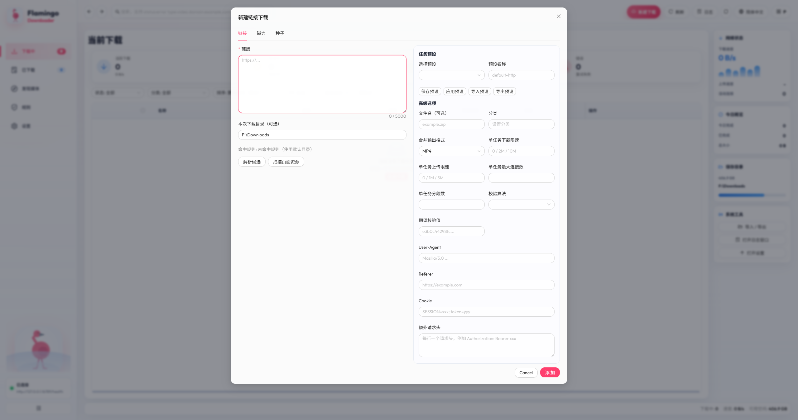
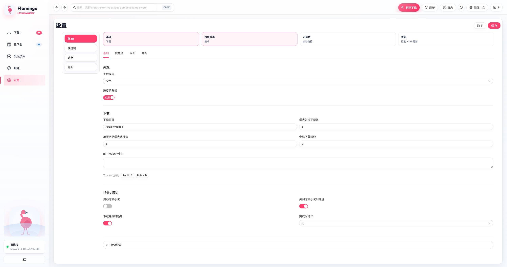

# 🦩 Flamingo Downloader

[](https://github.com/lc5900/flamingo-downloader/actions/workflows/build-release.yml)
[](LICENSE)
[](https://tauri.app)
[](https://www.rust-lang.org)

Flamingo Downloader 是一个基于 **Tauri + Rust + aria2** 的跨平台桌面下载器。

项目思路是：把复杂协议能力交给 aria2，把“稳定、好用、可维护”的下载产品体验做好。

English README: [`README.md`](README.md)

## 为什么是 Flamingo

- 支持 HTTP/HTTPS/FTP、magnet、`.torrent`
- 下载中 / 已下载分区清晰，常用操作完整
- SQLite 持久化 + 启动自检 + 任务恢复
- 任务级参数可控（限速、分片、做种、请求头、保存目录）
- 支持按 `ext/domain/type` 自动分流目录和分类
- 浏览器桥接 + 扩展（Chromium / Firefox）
- 支持 Native Messaging 模式
- 支持主题与国际化（`zh-CN` / `en-US`）

## 界面截图

最新截图位于 `docs/screenshots/`。

### 主界面



### 新建下载



### 设置页



## 快速开始

### 环境准备

- Rust（stable）
- Node.js 20.19+ 或 22.12+
- 对应系统的 Tauri 2 构建依赖
- 可用 `aria2c`（当前版本使用手动路径配置）

### 开发运行

```bash
cargo run --manifest-path src-tauri/Cargo.toml
```

### 可选：只跑前端

```bash
cd ui
npm install
npm run dev
```

如果 Vite 提示当前 Node.js 版本不受支持，先升级 Node，再继续排查前端构建问题。

### 首次使用建议

在 **设置页**：

1. 配置 `aria2 Binary Path`（或点击 `Detect aria2 Path`）
2. 保存配置
3. 点击 `Restart aria2`
4. 点击 `RPC Ping` 验证联通

## 本地构建

```bash
# 构建前端产物
npm --prefix ui run build

# 打包桌面应用
cd src-tauri
cargo tauri build
```

## CI / Release

流水线文件：`.github/workflows/build-release.yml`

主要包含：

- 校验：fmt、clippy、UI lint、UI 单测、UI 构建、bundle 大小检查
- 多平台构建：Linux / Windows / macOS arm64
- 打包前注入 aria2 二进制
- 上传桌面安装包和浏览器扩展 zip
- 推送 `v*` 标签自动发布 Release
- 配置 Apple secrets 后支持 macOS 签名/公证

## 架构说明

- **Tauri UI 层**：任务列表、弹窗、设置、日志
- **Rust 服务层**：aria2 生命周期、RPC、校验、编排、数据库
- **aria2 进程**：协议下载执行器

核心原则：

- UI 不直连 aria2 RPC
- RPC 仅本地监听并带 token 校验
- 应用任务模型是系统真相

## 浏览器集成

- 扩展目录：[`browser-extension/`](browser-extension)
- 扩展文档：[`browser-extension/README.md`](browser-extension/README.md)
- Native Host 脚本：[`browser-extension/native-host/`](browser-extension/native-host)
- DRM 说明：受 DRM 保护的流（Widevine/FairPlay/PlayReady）不支持下载

## 项目结构

```text
src/                # Rust 核心服务
src-tauri/          # Tauri 入口与打包配置
ui/                 # React + Ant Design 前端
aria2/              # bundled/runtime aria2 binaries
browser-extension/  # 浏览器扩展与 native host 脚本
```

## 许可证

MIT，见 [`LICENSE`](LICENSE)。

第三方说明：aria2 按其独立许可证分发与使用。
